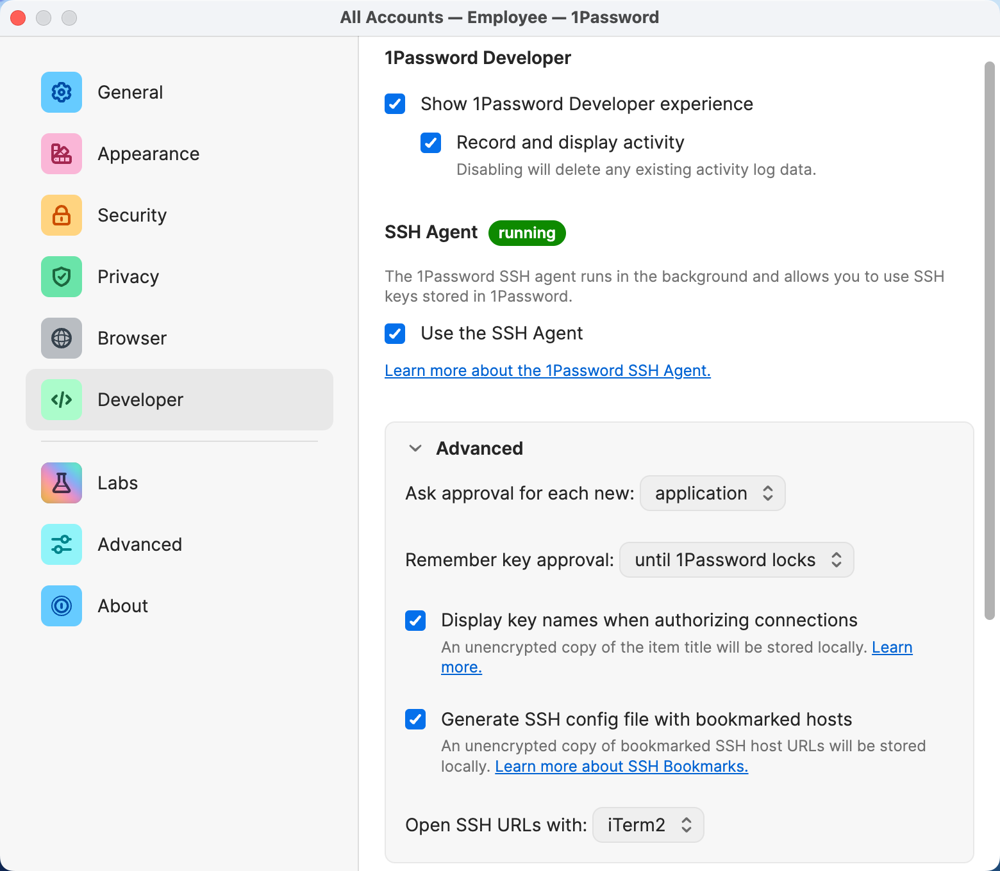
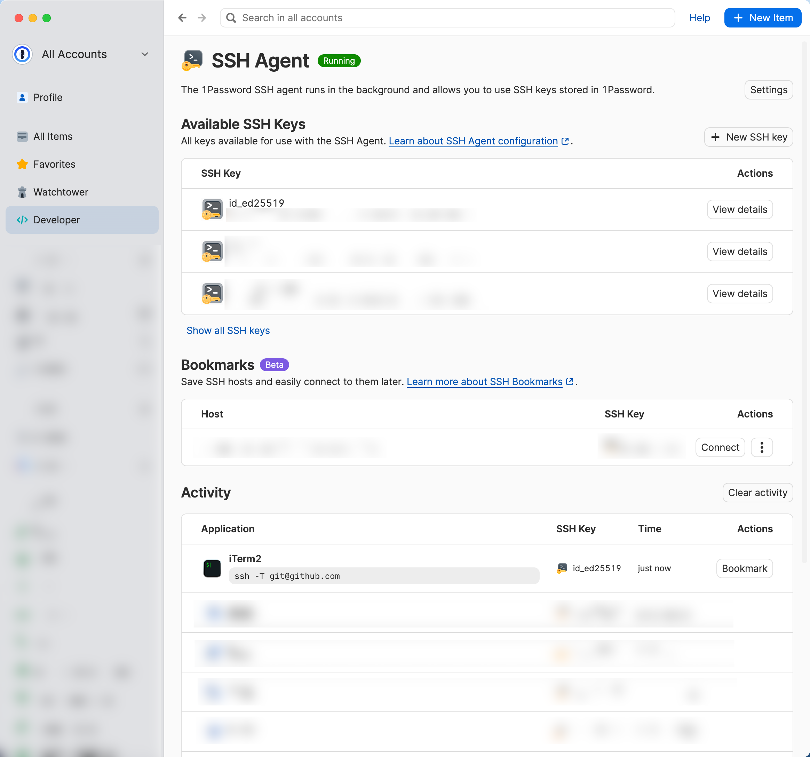

# Using SSH Keys from 1Password

Having SSH keys stored on the filesystem is a security risk. For that reason I store my SSH keys in 1Password and let it offer the keys to the SSH agent.

[Documentation](https://developer.1password.com/docs/ssh/get-started/)

## Setup

### Enabling the 1Password SSH agent

1. First, store your SSH key as such in 1Password.
1. Make sure [GitHub knows about your SSH key](https://github.com/settings/keys).
1. Turn on the 1Password SSH agent


### Configuring the SSH agent

> [!TIP]  
> If you are using these dotfiles, you can skip the following steps.

Add the `IdentityAgent` config to your `~/.ssh/config` file:

```ssh-config
Host *
    # Use 1Password as SSH Agent
    IdentityAgent "~/Library/Group Containers/2BUA8C4S2C.com.1password/t/agent.sock"
```

Add an `SSH_AUTH_SOCK` export to your shell profile:

```bash
export SSH_AUTH_SOCK=~/Library/Group\ Containers/2BUA8C4S2C.com.1password/t/agent.sock
```

Ensure `SSH_AUTH_SOCK` is configured globally for every client by following [this guide](https://developer.1password.com/docs/ssh/agent/compatibility/#configure-ssh_auth_sock-globally-for-every-client).

### Checking the SSH agent

Run the following command to check if the SSH agent recognizes your key:

```bash
ssh-add -l
```

Run the following command to check if the connection to github.com works:

```bash
ssh -T git@github.com
```

Check if 1Password is recording and displaying your activity:



### Additional Security Measures

If you want to protect against potential trojan horses offering unknown SSH keys to your SSH agent, you can enable `IdentitiesOnly` in your `~/.ssh/config`:

```ssh-config
Host *
    # ...

    # Use only the identity keys configured in the ssh config, ignoring any other keys ssh-agent may provide.
    IdentitiesOnly yes
```

> [!NOTE]
> If you do this, you will need to specify what key to use for each host using [1Password Bookmarks](https://developer.1password.com/docs/ssh/bookmarks).
